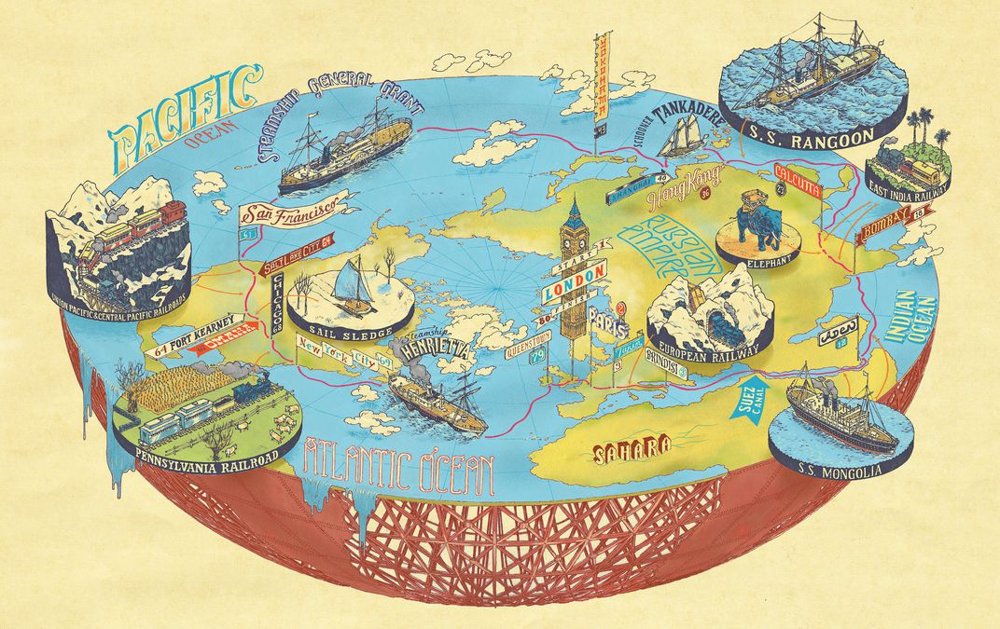

# Outrun Jules Verne!
This project aims to beat the best adventurer I know with the best name: Jules Verne.  His book "Around the World in 80 Days" chronicles a fictional around-the-world trip on a bet that Phileas Fogg and Passepartout complete it in 80 days.  Let's beat them at their game!

I'll help come up with an around-the-world trip path based on your selected features like sentiment and interests; you just be an adventurer and find something to bet on.

## Why?
First and foremost, it's fun! Travel recommendations are somewhat of a dated art; travel agencies have largely been replaced by Google in this interwebbed and globally-minded world. However, personalizing travels is still a great interest for the most individualistic modern population with the most autonomy the history has ever seen. This is my attempt at tailoring unique travels and experiences for you.

## What kind of data did I use?
- reviews from tripadvisor.com
- GIS data of local attractions

## How did I get the data?
- scrape tripadvisor.com
- GIS data

## How can I recommend a path around globe for you?
- Natural Language Processing to extract features like sentiment, local attractions, characteristics, etc.
- Monte Carlo Metropolis algorithm to find paths

## How well did I do?
- Show friends and others, and ask them to evaluate.

## Show & tell
- I plan to deploy this on a website :)

## Useful Information
 - https://www.goodreads.com/book/show/54479.Around_the_World_in_Eighty_Days
- https://am207.github.io/2017/wiki/lab4.html
- https://en.wikipedia.org/wiki/Cross-industry_standard_process_for_data_mining
