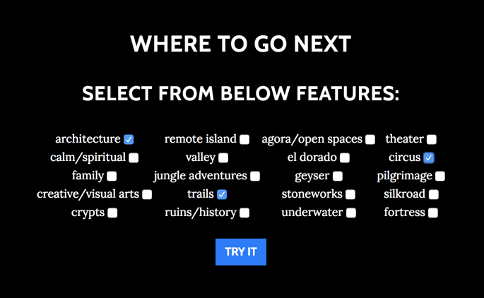
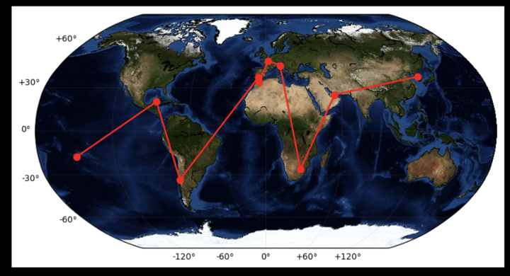
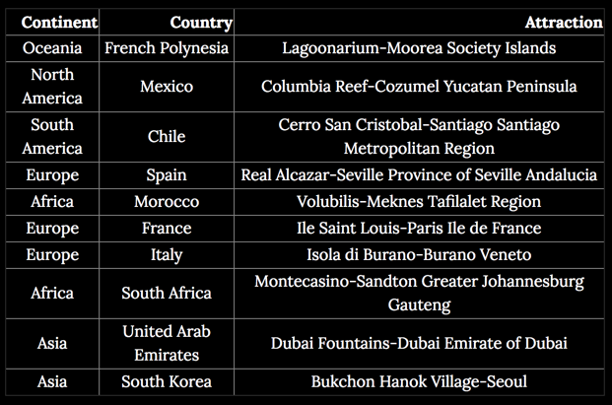

# Outrun Jules Verne!
This project aims to beat the best adventurer I know with the best name: Jules Verne.  His book "Around the World in 80 Days" chronicles a fictional around-the-world trip on a bet that Phileas Fogg and Passepartout complete it in 80 days.  Let's beat them at their game!

I'll help come up with an around-the-world trip path based on your selected features like sentiment and interests; you just be an adventurer and find something to bet on.

## Why?
First and foremost, it's fun! Travel recommendations are somewhat of a dated art; travel agencies have largely been replaced by Google in this interwebbed and globally-minded world. However, personalizing travels is still a great interest for the most individualistic modern population with the most autonomy the history has ever seen. This is my attempt at tailoring unique travels and experiences for you.

## What kind of data did I use?
- reviews from tripadvisor.com
    - At first, I requested access to their API, but they never got back to me. So, I relied on webscraping to build my dataset from scratch. The resulting 1M+ customer reviews of attractions around the globe are stored in a private AWS S3 bucket.
- GIS data of local attractions, i.e. the exact geographical locations of each attraction.

## How did I get the data?
- Webscraped tripadvisor.com using `request` and `BeautifulSoup`
- GIS data: publicly available

## How can I recommend a path around globe for you?
- Natural Language Processing to extract features like sentiment, local attractions, characteristics, etc.
- Monte Carlo Metropolis algorithm to add some randomness.

For detailed implementation, take a look at `README.md` in `src` folder.

## How well did I do?
- Show friends and others, and ask them to evaluate. (I still have the survey scores, and it was around 4 / out of 5!)

## Show & tell
The project *used to be* deployed as a webapp: ~~http://outrunjulesverne.com/.~~ However, the URL is no longer active. For how it used to look, please view [this presentation](https://docs.google.com/presentation/d/1JuGs_KHnCfcJgEeBP_-hz9N0NTFQ0OAd7PhthRrp3yY/edit). But as a quick look, here's an example of selected features:

And one example of an output path around the world is:

And along the way, you'll see these beauties of the world:

This app may come back in the near future :]. I really enjoyed this project, and hope you did too. Welp, at least maybe inspire a grand trip.

## Useful Information
 - https://www.goodreads.com/book/show/54479.Around_the_World_in_Eighty_Days
- https://am207.github.io/2017/wiki/lab4.html
- https://en.wikipedia.org/wiki/Cross-industry_standard_process_for_data_mining
